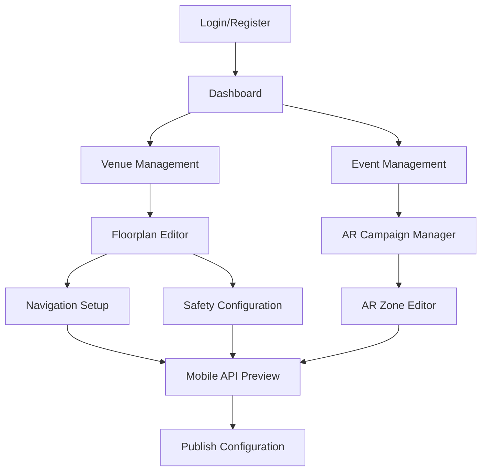

# NavEaze V5 Organizer DPM MVP - Product Requirements Document

## 1. Product Overview

NavEaze V5 DPM is a comprehensive web-based Digital Product Management platform designed specifically for event organizers to configure indoor navigation systems and AR experiences. The platform enables venue managers to create interactive floorplans, define navigation paths including critical safety routes, and manage AR campaigns for enhanced attendee experiences.

The primary goal is to provide event organizers with a powerful yet intuitive tool to digitally map their venues, ensuring both optimal attendee navigation and critical safety compliance through emergency path configuration.

## 2. Core Features

### 2.1 User Roles

| Role | Registration Method | Core Permissions |
|------|---------------------|------------------|
| Event Organizer | Email registration with venue verification | Full access to create/edit events, venues, floorplans, and AR campaigns |
| Venue Manager | Invitation-based registration | Can manage assigned venues and their associated events |

### 2.2 Feature Module

Our NavEaze V5 DPM requirements consist of the following main pages:

1. **Authentication Pages**: Login, registration, and password recovery functionality
2. **Dashboard**: Overview of events, venues, and recent activities with quick access navigation
3. **Event Management**: Complete CRUD operations for events with venue assignment and scheduling
4. **Venue Management**: Venue creation, editing, and floorplan association management
5. **Interactive Floorplan Editor**: Advanced drag-and-drop editor for navigation nodes, POIs, paths, and safety configurations
6. **AR Campaign Management**: Creation and management of AR experiences with asset upload and zone definition
7. **Safety Configuration**: Dedicated interface for emergency paths, first aid stations, and safety POI placement

### 2.3 Page Details

| Page Name | Module Name | Feature Description |
|-----------|-------------|---------------------|
| Login Page | Authentication | Email/password login, remember me option, forgot password link |
| Registration Page | Authentication | Organizer signup with email verification, venue details collection |
| Dashboard | Overview | Event summary cards, venue status indicators, recent activity feed, quick action buttons |
| Event Management | Event CRUD | Create new events, edit event details, assign venues, set dates/times, event status management |
| Venue Management | Venue CRUD | Add new venues, edit venue information, upload venue images, manage floorplan associations |
| Floorplan Editor | Interactive Editor | Image upload, drag-and-drop node placement, path drawing tools, POI categorization, zoom/pan controls |
| Navigation Setup | Path Configuration | Define walkable paths, set path weights, configure accessibility routes, path validation |
| Safety Configuration | Emergency Management | Place emergency exits, define evacuation routes, mark first aid stations, safety zone designation |
| AR Campaign Manager | AR Content | Create AR campaigns, upload 3D assets/videos, define trigger zones, preview AR content |
| AR Zone Editor | Zone Definition | Draw AR activation zones on floorplan, set zone properties, configure AR content associations |
| Mobile API Preview | Data Validation | Preview mobile endpoint responses, validate JSON structure, test API connectivity |

## 3. Core Process

**Event Organizer Flow:**
1. Register/Login to access the DPM portal
2. Create or select an existing venue
3. Upload venue floorplan image and configure basic venue details
4. Use the interactive editor to place navigation nodes and define walkable paths
5. Configure critical safety elements (emergency exits, evacuation routes, first aid stations)
6. Create and configure AR campaigns with associated trigger zones
7. Preview and validate mobile API endpoints
8. Publish event configuration for mobile app consumption

**Venue Manager Flow:**
1. Access assigned venues through invitation-based login
2. Update venue-specific information and floorplan modifications
3. Collaborate on safety configuration and AR content management

## 4. User Interface Design

### 4.1 Design Style

- **Primary Colors**: Deep blue (#1e40af) for navigation and primary actions, emerald green (#059669) for success states
- **Secondary Colors**: Slate gray (#64748b) for secondary text, red (#dc2626) for emergency/safety elements
- **Button Style**: Rounded corners (8px radius) with subtle shadows, hover state transitions
- **Typography**: Inter font family, 16px base size for body text, 24px+ for headings
- **Layout Style**: Clean card-based design with generous whitespace, left sidebar navigation
- **Icons**: Heroicons for consistency, safety icons use universally recognized symbols

### 4.2 Page Design Overview

| Page Name | Module Name | UI Elements |
|-----------|-------------|-------------|
| Dashboard | Overview Cards | Grid layout with metric cards, color-coded status indicators, floating action button for quick event creation |
| Floorplan Editor | Interactive Canvas | Full-screen editor with floating toolbar, layer panel, zoom controls, grid overlay toggle |
| Navigation Setup | Path Tools | Sidebar tool palette, path weight sliders, accessibility toggle switches, validation status panel |
| Safety Configuration | Emergency Tools | Red-themed safety toolbar, emergency icon library, evacuation route drawing tools, compliance checklist |
| AR Campaign Manager | Content Library | Media upload dropzone, 3D model preview, campaign timeline, zone association matrix |

### 4.3 Responsiveness

The application is desktop-first with tablet adaptation for the floorplan editor. Mobile responsiveness is limited to basic navigation and preview functions, as the primary interactive editing requires larger screen real estate for precision work.