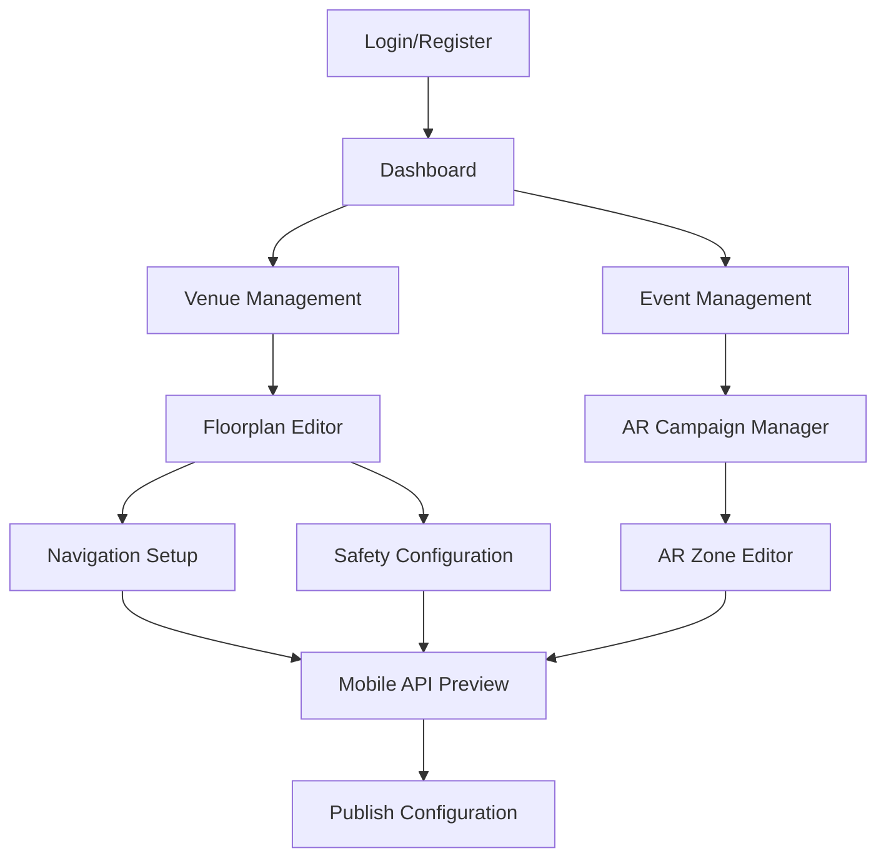

# NavEaze DPM MVP: Phase 1 Concise PRD - Product Requirements Document

## 1. Product Overview

NavEaze DPM MVP is an API-First, Safety-Guaranteed platform designed to achieve Freemium Acquisition through safety compliance and enable AR Revenue Configuration for monetization. This is not a full event management system - we are selling the ability to quickly configure a map for compliance and revenue.

The platform provides organizers with AI-enhanced tools to upload floorplans, automatically suggest POI placements, configure emergency routes with compliance flags, and set up AR campaigns with geographical zones. The core strategic pivot focuses on Integration-Lite strategy, allowing third parties to easily consume our data via robust APIs.

Target market includes South African venues requiring low-bandwidth optimization and compliance-focused event organizers seeking revenue opportunities through AR experiences.

## 2. Core Features

### 2.1 User Roles

| Role | Registration Method | Core Permissions |
|------|---------------------|------------------|
| Event Organizer | Secure Supabase/JWT registration | Full DPM access: floorplan upload, emergency route configuration, AR campaign setup |
| API Consumer | Developer key registration | Read-only access to map data and AR content via optimized endpoints |

### 2.2 Feature Module

Our NavEaze DPM MVP consists of the following core modules:

1. **Safety & Setup (Freemium)**: Floorplan Upload & Map Editor Interface with AI-enhanced POI placement suggestions
2. **Emergency Route Configuration**: Full functionality for setting `is_emergency_route: true` flags with compliance validation
3. **AR Campaign Setup (Revenue)**: Geographical AR Zone definition with automatic asset processing
4. **API/SDK Readiness**: Core endpoints serving Map Data and AR Content for third-party integration
5. **Authentication**: Secure organizer login/registration with role enforcement

### 2.3 Page Details

| Page Name | Module Name | Feature Description |
|-----------|-------------|---------------------|
| Login Page | Authentication | Secure Supabase/JWT login, role enforcement, developer key management |
| Floorplan Upload | AI-Enhanced Setup | PDF/JPEG upload with AI analysis for automatic POI placement suggestions, boundary detection |
| Map Editor | Safety Configuration | Interactive canvas with emergency route flagging (`is_emergency_route: true`), compliance validation |
| Emergency Routes | Compliance Management | Dedicated emergency path configuration, evacuation route validation, safety compliance checks |
| AR Campaign Setup | Revenue Configuration | Geographical zone definition (bounding box/polygon), AR asset upload with automatic processing |
| Asset Processing | Zumi AI Integration | Automatic resizing and format optimization of vendor assets (logos, 3D models) for AR SDK |
| API Documentation | Developer Integration | SDK documentation, endpoint testing, low-bandwidth optimization settings |
| Mobile API Endpoints | Third-party Access | Optimized map data and AR content serving, caching for South African market |

## 3. Core Process

**API-First Organizer Flow (MVP):**
1. Secure login with Supabase/JWT authentication
2. Upload floorplan (PDF/JPEG) with AI analysis for POI suggestions
3. Configure emergency routes with `is_emergency_route: true` flags for compliance
4. Set up AR campaigns with geographical zones and automatic asset processing
5. Validate API endpoints for third-party integration
6. Publish configuration for mobile SDK consumption

**Strategic Deferrals (Post-Seed):**
- Analytics & Reporting Dashboard
- Real-time Services (high cost, high data consumption)
- Full SOC 2 Security Compliance

## 4. User Interface Design

### 4.1 Design Style

- **Primary Colors:** Professional blue (#1e40af) for API/developer trust, safety green (#10b981) for compliance indicators
- **Secondary Colors:** Warning orange (#f59e0b), emergency red (#ef4444) for safety elements
- **Button Style:** Clean, developer-friendly interface with clear CTAs for API actions
- **Typography:** Inter font family, optimized for technical documentation and forms
- **Layout:** API-first dashboard with compliance validation, minimal cognitive load
- **Icons:** Safety-focused iconography, API status indicators, AI processing states

### 4.2 Page Design Overview

| Page Name | Module Name | UI Elements |
|-----------|-------------|-------------|
| Floorplan Upload | AI Analysis | Drag-drop zone, AI processing indicators, POI suggestion overlays |
| Map Editor | Safety Canvas | Emergency route highlighting, compliance validation badges, grid-based editing |
| AR Campaign Setup | Revenue Tools | Geographical zone drawing, asset upload with AI processing status |
| API Documentation | Developer Portal | Code examples, endpoint testing, bandwidth optimization toggles |

### 4.3 Responsiveness

Desktop-optimized for organizer workflow. Mobile-responsive API documentation for developer access. Touch optimization deferred to post-MVP.