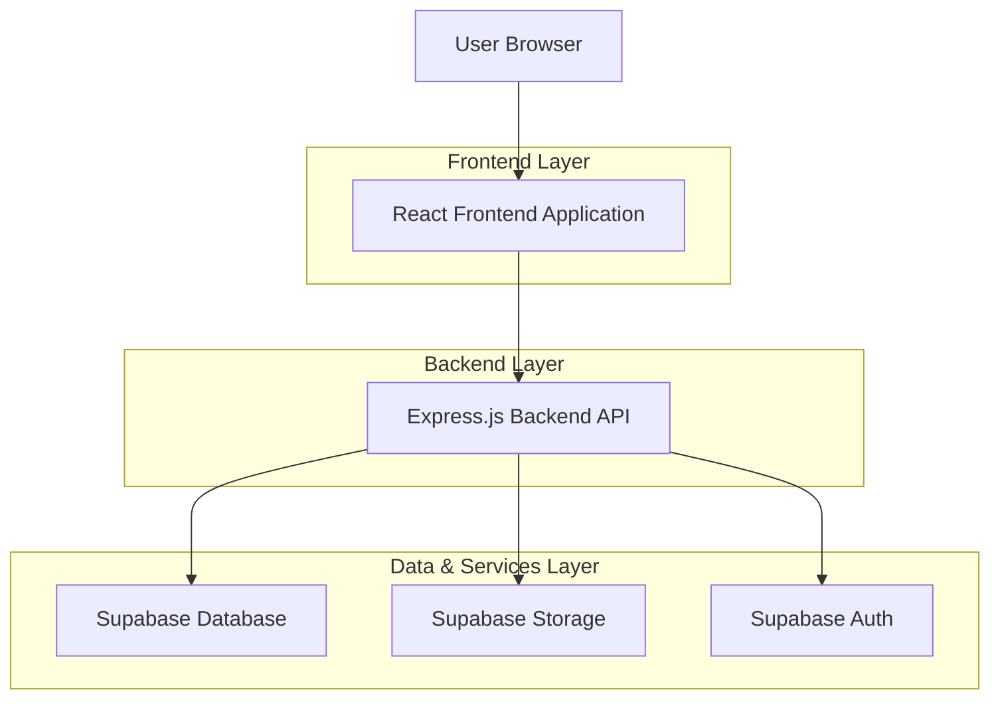
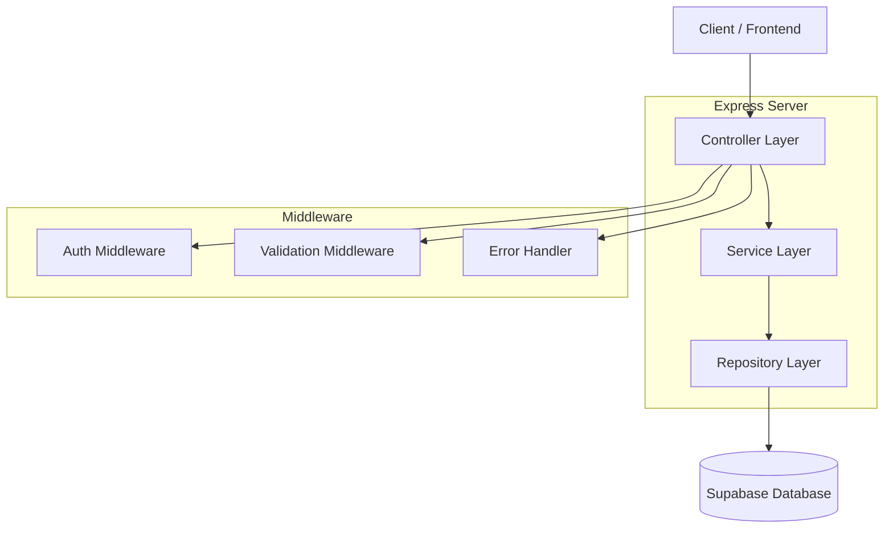
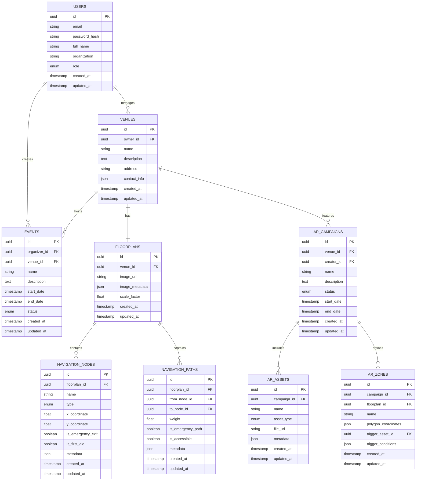

# NavEaze V5 DPM MVP - Technical Architecture Document

## 1. Architecture Design



## 2. Technology Description

- **Frontend**: React@18 + TypeScript@5 + Tailwind CSS@3 + Vite@5
- **Backend**: Node.js@20 + Express@4 + TypeScript@5
- **Database**: Supabase (PostgreSQL)
- **Authentication**: Supabase Auth
- **File Storage**: Supabase Storage
- **Deployment**: Frontend (Vercel) + Backend (Railway/Render)
- **CI/CD**: GitHub Actions

## 3. Route Definitions

| Route | Purpose |
|-------|----------|
| / | Landing page with login/register options |
| /login | User authentication page |
| /register | New organizer registration |
| /dashboard | Main dashboard with events and venues overview |
| /events | Event management and listing |
| /events/:id | Individual event details and configuration |
| /venues | Venue management and listing |
| /venues/:id | Individual venue details and floorplan editor |
| /venues/:id/floorplan | Interactive floorplan editor interface |
| /venues/:id/safety | Safety configuration and emergency path setup |
| /ar-campaigns | AR campaign management dashboard |
| /ar-campaigns/:id | Individual AR campaign editor |
| /api-preview | Mobile API endpoint testing and validation |

## 4. API Definitions

### 4.1 Core API

**Authentication**
```
POST /api/auth/login
```
Request:
| Param Name | Param Type | isRequired | Description |
|------------|------------|------------|-------------|
| email | string | true | User email address |
| password | string | true | User password |

Response:
| Param Name | Param Type | Description |
|------------|------------|-------------|
| success | boolean | Authentication status |
| user | object | User profile data |
| token | string | JWT access token |

**Event Management**
```
GET /api/events
POST /api/events
GET /api/events/:id
PUT /api/events/:id
DELETE /api/events/:id
```

**Venue Management**
```
GET /api/venues
POST /api/venues
GET /api/venues/:id
PUT /api/venues/:id
DELETE /api/venues/:id
```

**Floorplan Configuration**
```
GET /api/venues/:id/floorplan
PUT /api/venues/:id/floorplan
POST /api/venues/:id/navigation-nodes
PUT /api/venues/:id/navigation-nodes/:nodeId
DELETE /api/venues/:id/navigation-nodes/:nodeId
```

**AR Campaign Management**
```
GET /api/ar-campaigns
POST /api/ar-campaigns
GET /api/ar-campaigns/:id
PUT /api/ar-campaigns/:id
DELETE /api/ar-campaigns/:id
POST /api/ar-campaigns/:id/assets
```

**Mobile API Endpoints (Read-Only)**
```
GET /api/mobile/events/:id/floorplan
GET /api/mobile/ar-content/:venueId
```

Mobile Floorplan Response:
```json
{
  "venueId": "uuid",
  "floorplanImage": "https://storage.url/image.jpg",
  "navigationNodes": [
    {
      "id": "uuid",
      "x": 100,
      "y": 200,
      "type": "poi",
      "name": "Main Entrance",
      "isEmergencyExit": false
    }
  ],
  "navigationPaths": [
    {
      "id": "uuid",
      "fromNodeId": "uuid",
      "toNodeId": "uuid",
      "weight": 1.0,
      "isEmergencyPath": false
    }
  ]
}
```

## 5. Server Architecture Diagram



## 6. Data Model

### 6.1 Data Model Definition



### 6.2 Data Definition Language

**Users Table**
```sql
CREATE TABLE users (
    id UUID PRIMARY KEY DEFAULT gen_random_uuid(),
    email VARCHAR(255) UNIQUE NOT NULL,
    password_hash VARCHAR(255) NOT NULL,
    full_name VARCHAR(100) NOT NULL,
    organization VARCHAR(100),
    role VARCHAR(20) DEFAULT 'organizer' CHECK (role IN ('organizer', 'venue_manager')),
    created_at TIMESTAMP WITH TIME ZONE DEFAULT NOW(),
    updated_at TIMESTAMP WITH TIME ZONE DEFAULT NOW()
);

CREATE INDEX idx_users_email ON users(email);
CREATE INDEX idx_users_role ON users(role);
```

**Venues Table**
```sql
CREATE TABLE venues (
    id UUID PRIMARY KEY DEFAULT gen_random_uuid(),
    owner_id UUID NOT NULL REFERENCES users(id) ON DELETE CASCADE,
    name VARCHAR(200) NOT NULL,
    description TEXT,
    address TEXT,
    contact_info JSONB,
    created_at TIMESTAMP WITH TIME ZONE DEFAULT NOW(),
    updated_at TIMESTAMP WITH TIME ZONE DEFAULT NOW()
);

CREATE INDEX idx_venues_owner_id ON venues(owner_id);
CREATE INDEX idx_venues_name ON venues(name);
```

**Events Table**
```sql
CREATE TABLE events (
    id UUID PRIMARY KEY DEFAULT gen_random_uuid(),
    organizer_id UUID NOT NULL REFERENCES users(id) ON DELETE CASCADE,
    venue_id UUID NOT NULL REFERENCES venues(id) ON DELETE CASCADE,
    name VARCHAR(200) NOT NULL,
    description TEXT,
    start_date TIMESTAMP WITH TIME ZONE NOT NULL,
    end_date TIMESTAMP WITH TIME ZONE NOT NULL,
    status VARCHAR(20) DEFAULT 'draft' CHECK (status IN ('draft', 'published', 'active', 'completed', 'cancelled')),
    created_at TIMESTAMP WITH TIME ZONE DEFAULT NOW(),
    updated_at TIMESTAMP WITH TIME ZONE DEFAULT NOW()
);

CREATE INDEX idx_events_organizer_id ON events(organizer_id);
CREATE INDEX idx_events_venue_id ON events(venue_id);
CREATE INDEX idx_events_start_date ON events(start_date);
CREATE INDEX idx_events_status ON events(status);
```

**Floorplans Table**
```sql
CREATE TABLE floorplans (
    id UUID PRIMARY KEY DEFAULT gen_random_uuid(),
    venue_id UUID NOT NULL REFERENCES venues(id) ON DELETE CASCADE,
    image_url TEXT NOT NULL,
    image_metadata JSONB,
    scale_factor FLOAT DEFAULT 1.0,
    created_at TIMESTAMP WITH TIME ZONE DEFAULT NOW(),
    updated_at TIMESTAMP WITH TIME ZONE DEFAULT NOW()
);

CREATE INDEX idx_floorplans_venue_id ON floorplans(venue_id);
```

**Navigation Nodes Table**
```sql
CREATE TABLE navigation_nodes (
    id UUID PRIMARY KEY DEFAULT gen_random_uuid(),
    floorplan_id UUID NOT NULL REFERENCES floorplans(id) ON DELETE CASCADE,
    name VARCHAR(100) NOT NULL,
    type VARCHAR(50) NOT NULL CHECK (type IN ('poi', 'entrance', 'exit', 'restroom', 'elevator', 'stairs', 'emergency_exit', 'first_aid')),
    x_coordinate FLOAT NOT NULL,
    y_coordinate FLOAT NOT NULL,
    is_emergency_exit BOOLEAN DEFAULT FALSE,
    is_first_aid BOOLEAN DEFAULT FALSE,
    metadata JSONB,
    created_at TIMESTAMP WITH TIME ZONE DEFAULT NOW(),
    updated_at TIMESTAMP WITH TIME ZONE DEFAULT NOW()
);

CREATE INDEX idx_navigation_nodes_floorplan_id ON navigation_nodes(floorplan_id);
CREATE INDEX idx_navigation_nodes_type ON navigation_nodes(type);
CREATE INDEX idx_navigation_nodes_emergency ON navigation_nodes(is_emergency_exit);
```

**Navigation Paths Table**
```sql
CREATE TABLE navigation_paths (
    id UUID PRIMARY KEY DEFAULT gen_random_uuid(),
    floorplan_id UUID NOT NULL REFERENCES floorplans(id) ON DELETE CASCADE,
    from_node_id UUID NOT NULL REFERENCES navigation_nodes(id) ON DELETE CASCADE,
    to_node_id UUID NOT NULL REFERENCES navigation_nodes(id) ON DELETE CASCADE,
    weight FLOAT DEFAULT 1.0,
    is_emergency_path BOOLEAN DEFAULT FALSE,
    is_accessible BOOLEAN DEFAULT TRUE,
    metadata JSONB,
    created_at TIMESTAMP WITH TIME ZONE DEFAULT NOW(),
    updated_at TIMESTAMP WITH TIME ZONE DEFAULT NOW(),
    CONSTRAINT unique_path UNIQUE(from_node_id, to_node_id)
);

CREATE INDEX idx_navigation_paths_floorplan_id ON navigation_paths(floorplan_id);
CREATE INDEX idx_navigation_paths_from_node ON navigation_paths(from_node_id);
CREATE INDEX idx_navigation_paths_to_node ON navigation_paths(to_node_id);
CREATE INDEX idx_navigation_paths_emergency ON navigation_paths(is_emergency_path);
```

**AR Campaigns Table**
```sql
CREATE TABLE ar_campaigns (
    id UUID PRIMARY KEY DEFAULT gen_random_uuid(),
    venue_id UUID NOT NULL REFERENCES venues(id) ON DELETE CASCADE,
    creator_id UUID NOT NULL REFERENCES users(id) ON DELETE CASCADE,
    name VARCHAR(200) NOT NULL,
    description TEXT,
    status VARCHAR(20) DEFAULT 'draft' CHECK (status IN ('draft', 'active', 'paused', 'completed')),
    start_date TIMESTAMP WITH TIME ZONE,
    end_date TIMESTAMP WITH TIME ZONE,
    created_at TIMESTAMP WITH TIME ZONE DEFAULT NOW(),
    updated_at TIMESTAMP WITH TIME ZONE DEFAULT NOW()
);

CREATE INDEX idx_ar_campaigns_venue_id ON ar_campaigns(venue_id);
CREATE INDEX idx_ar_campaigns_creator_id ON ar_campaigns(creator_id);
CREATE INDEX idx_ar_campaigns_status ON ar_campaigns(status);
```

**AR Assets Table**
```sql
CREATE TABLE ar_assets (
    id UUID PRIMARY KEY DEFAULT gen_random_uuid(),
    campaign_id UUID NOT NULL REFERENCES ar_campaigns(id) ON DELETE CASCADE,
    name VARCHAR(200) NOT NULL,
    asset_type VARCHAR(50) NOT NULL CHECK (asset_type IN ('3d_model', 'video', 'image', 'audio')),
    file_url TEXT NOT NULL,
    metadata JSONB,
    created_at TIMESTAMP WITH TIME ZONE DEFAULT NOW(),
    updated_at TIMESTAMP WITH TIME ZONE DEFAULT NOW()
);

CREATE INDEX idx_ar_assets_campaign_id ON ar_assets(campaign_id);
CREATE INDEX idx_ar_assets_type ON ar_assets(asset_type);
```

**AR Zones Table**
```sql
CREATE TABLE ar_zones (
    id UUID PRIMARY KEY DEFAULT gen_random_uuid(),
    campaign_id UUID NOT NULL REFERENCES ar_campaigns(id) ON DELETE CASCADE,
    floorplan_id UUID NOT NULL REFERENCES floorplans(id) ON DELETE CASCADE,
    name VARCHAR(200) NOT NULL,
    polygon_coordinates JSONB NOT NULL,
    trigger_asset_id UUID REFERENCES ar_assets(id) ON DELETE SET NULL,
    trigger_conditions JSONB,
    created_at TIMESTAMP WITH TIME ZONE DEFAULT NOW(),
    updated_at TIMESTAMP WITH TIME ZONE DEFAULT NOW()
);

CREATE INDEX idx_ar_zones_campaign_id ON ar_zones(campaign_id);
CREATE INDEX idx_ar_zones_floorplan_id ON ar_zones(floorplan_id);
```

**Row Level Security (RLS) Policies**
```sql
-- Enable RLS on all tables
ALTER TABLE users ENABLE ROW LEVEL SECURITY;
ALTER TABLE venues ENABLE ROW LEVEL SECURITY;
ALTER TABLE events ENABLE ROW LEVEL SECURITY;
ALTER TABLE floorplans ENABLE ROW LEVEL SECURITY;
ALTER TABLE navigation_nodes ENABLE ROW LEVEL SECURITY;
ALTER TABLE navigation_paths ENABLE ROW LEVEL SECURITY;
ALTER TABLE ar_campaigns ENABLE ROW LEVEL SECURITY;
ALTER TABLE ar_assets ENABLE ROW LEVEL SECURITY;
ALTER TABLE ar_zones ENABLE ROW LEVEL SECURITY;

-- Basic access policies
GRANT SELECT ON ALL TABLES IN SCHEMA public TO anon;
GRANT ALL PRIVILEGES ON ALL TABLES IN SCHEMA public TO authenticated;
```

**Initial Data**
```sql
-- Sample organizer user
INSERT INTO users (email, password_hash, full_name, organization, role)
VALUES (
    'demo@naveaze.com',
    '$2b$10$example_hash',
    'Demo Organizer',
    'NavEaze Demo',
    'organizer'
);
```