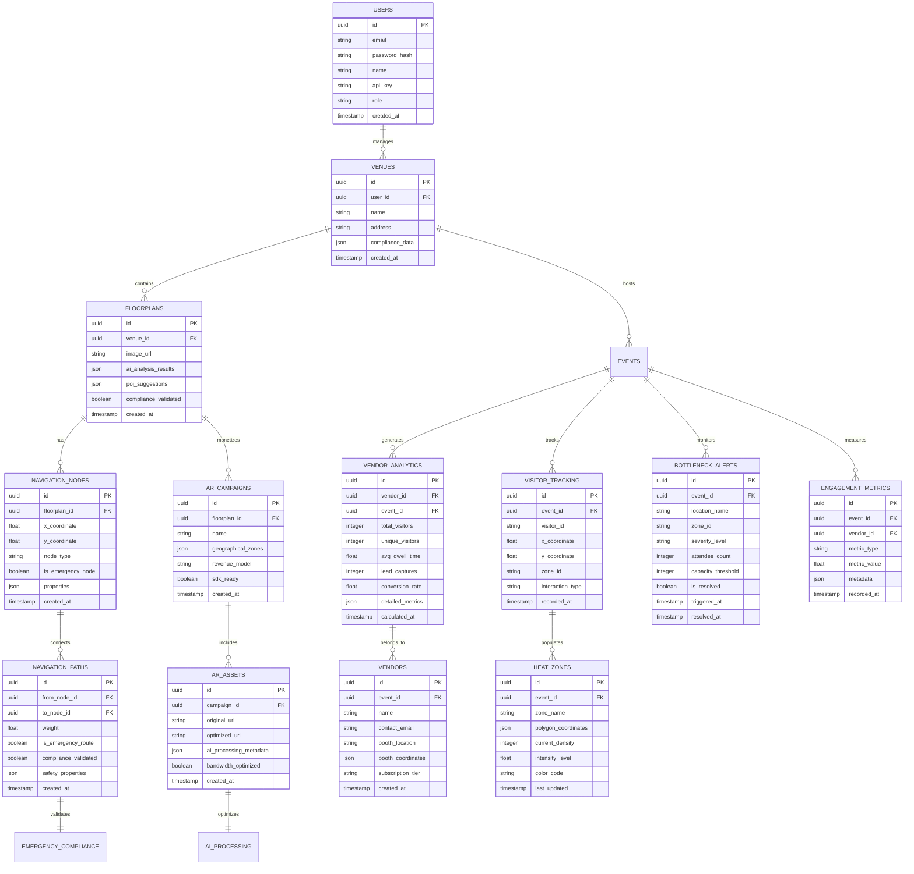

# NavEaze V5 DPM MVP - Technical Architecture Document

## 1. Architecture Design


## 2. Technology Description

- **Frontend:** React@18 + TypeScript + Tailwind CSS + Vite (API-first dashboard)
- **Backend:** Node.js + Express@4 + TypeScript (Mobile SDK endpoints)
- **Database:** Supabase (PostgreSQL) with emergency route compliance schema
- **Authentication:** Supabase Auth with JWT + role-based API access
- **AI Services:** Floorplan analysis + Zumi AI asset processing
- **Optimization:** API caching + low-bandwidth mode for South African market
- **Integration:** Mobile SDK documentation + third-party developer tools

## 3. Route Definitions

| Route | Purpose |
|-------|----------|
| `/` | Secure login with Supabase/JWT authentication |
| `/upload` | Floorplan upload with AI analysis for POI suggestions |
| `/editor/:id` | Map editor with emergency route configuration |
| `/emergency/:id` | Dedicated emergency path setup with compliance validation |
| `/ar-campaigns` | AR campaign setup with geographical zone definition |
| `/assets` | AI-powered asset processing and optimization |
| `/api-docs` | SDK documentation for third-party developers |
| `/api/mobile/*` | Mobile SDK endpoints with caching optimization |
| `/analytics/heatmap/:eventId` | Real-time heatmap visualizer for attendee density |
| `/analytics/engagement/:eventId` | Engagement velocity reports with vendor metrics |
| `/analytics/bottlenecks/:eventId` | Bottleneck alert dashboard with crowd monitoring |
| `/vendor/:vendorId/analytics` | Vendor-specific data access and analytics filtering |
| `/alerts/configure` | Bottleneck alert configuration and threshold settings |

## 4. API Definitions

### 4.1 Authentication API (Supabase/JWT)

**Secure Organizer Login**
```
POST /api/auth/login
```

Request:
| Param Name | Param Type | isRequired | Description |
|------------|------------|------------|-------------|
| email | string | true | Organizer email |
| password | string | true | Secure password |

Response:
| Param Name | Param Type | Description |
|------------|------------|-------------|
| access_token | string | JWT with role-based permissions |
| api_key | string | Developer API key for third-party access |

### 4.2 Floorplan Upload & AI Analysis

**Upload with AI Processing**
```
POST /api/floorplans/upload
```

Request:
| Param Name | Param Type | isRequired | Description |
|------------|------------|------------|-------------|
| file | file | true | PDF/JPEG floorplan |
| venue_id | string | true | Associated venue |

Response:
| Param Name | Param Type | Description |
|------------|------------|-------------|
| ai_suggestions | array | Automatic POI placement suggestions |
| boundary_nodes | array | AI-detected boundary coordinates |
| processing_status | string | AI analysis completion status |

### 4.3 Emergency Route Configuration

**Configure Emergency Paths**
```
PUT /api/navigation/emergency/:floorplanId
```

Request:
| Param Name | Param Type | isRequired | Description |
|------------|------------|------------|-------------|
| paths | array | true | Emergency route paths |
| is_emergency_route | boolean | true | Compliance flag (must be true) |
| evacuation_zones | array | true | Safe evacuation areas |

Response:
| Param Name | Param Type | Description |
|------------|------------|-------------|
| compliance_status | boolean | Safety compliance validation |
| emergency_routes | array | Validated emergency paths |

### 4.4 AR Campaign & Asset Processing

**Create AR Campaign with AI Processing**
```
POST /api/ar-campaigns
```

Request:
| Param Name | Param Type | isRequired | Description |
|------------|------------|------------|-------------|
| name | string | true | Campaign name |
| geographical_zones | array | true | Bounding box/polygon zones |
| vendor_assets | array | true | Raw logos, 3D models |

Response:
| Param Name | Param Type | Description |
|------------|------------|-------------|
| processed_assets | array | Zumi AI optimized assets |
| ar_zones | array | Geographical zone definitions |
| sdk_ready | boolean | Mobile SDK compatibility status |

### 4.5 Mobile SDK Endpoints (Third-party Integration)

**Get Optimized Map Data**
```
GET /api/mobile/maps/:eventId
```

Response (Cached for South African market):
| Param Name | Param Type | Description |
|------------|------------|-------------|
| emergency_routes | array | Safety-compliant evacuation paths |
| navigation_data | object | Optimized pathfinding data |
| low_bandwidth_mode | boolean | Reduced data payload option |

**Get AR Content**
```
GET /api/mobile/ar/:eventId
```

Response:
| Param Name | Param Type | Description |
|------------|------------|-------------|
| ar_campaigns | array | Revenue-generating AR content |
| geographical_zones | array | Precise AR activation areas |
| optimized_assets | array | Bandwidth-optimized media files |

Mobile Floorplan Response:
```json
{
  "venueId": "uuid",
  "floorplanImage": "https://storage.url/image.jpg",
  "navigationNodes": [
    {
      "id": "uuid",
      "x": 100,
      "y": 200,
      "type": "poi",
      "name": "Main Entrance",
      "isEmergencyExit": false
    }
  ],
  "navigationPaths": [
    {
      "id": "uuid",
      "fromNodeId": "uuid",
      "toNodeId": "uuid",
      "weight": 1.0,
      "isEmergencyPath": false
    }
  ]
}
```

### 4.6 Real-Time Analytics API (B2B Revenue Features)

**Real-Time Heatmap Data**
```
GET /api/analytics/heatmap/:eventId
```

Request Headers:
| Header Name | Header Type | isRequired | Description |
|-------------|-------------|------------|-------------|
| Authorization | Bearer JWT | true | Organizer or vendor access token |
| X-Vendor-ID | string | false | Vendor-specific filtering |

Response:
| Param Name | Param Type | Description |
|------------|------------|-------------|
| density_data | array | Real-time attendee density by zone |
| heat_zones | array | Color-coded density visualization data |
| timestamp | string | Last update timestamp |
| total_attendees | number | Current total attendee count |

Example Response:
```json
{
  "density_data": [
    {
      "zone_id": "uuid",
      "zone_name": "Main Entrance",
      "attendee_count": 45,
      "density_level": "high",
      "coordinates": {"x": 100, "y": 200, "radius": 50}
    }
  ],
  "heat_zones": [
    {
      "polygon": [[100,100], [200,100], [200,200], [100,200]],
      "intensity": 0.8,
      "color": "#ff4444"
    }
  ],
  "timestamp": "2024-01-15T10:30:00Z",
  "total_attendees": 1250
}
```

**Engagement Velocity Reports**
```
GET /api/analytics/engagement/:eventId
```

Request Parameters:
| Param Name | Param Type | isRequired | Description |
|------------|------------|------------|-------------|
| vendor_id | string | false | Filter by specific vendor |
| time_range | string | false | "1h", "24h", "7d" (default: "24h") |
| metrics | array | false | Specific metrics to include |

Response:
| Param Name | Param Type | Description |
|------------|------------|-------------|
| vendor_metrics | array | Vendor-specific engagement data |
| dwell_time_analytics | object | Average dwell time by zone |
| lead_capture_rate | number | Conversion rate percentage |
| engagement_velocity | object | Engagement trend over time |

Example Response:
```json
{
  "vendor_metrics": [
    {
      "vendor_id": "uuid",
      "vendor_name": "TechCorp",
      "booth_zone": "A1",
      "total_visitors": 324,
      "avg_dwell_time": 180,
      "lead_captures": 45,
      "conversion_rate": 13.9,
      "revenue_attribution": 2850.00
    }
  ],
  "dwell_time_analytics": {
    "overall_average": 145,
    "by_zone": {
      "entrance": 30,
      "vendor_area": 180,
      "food_court": 240
    }
  },
  "lead_capture_rate": 12.5,
  "engagement_velocity": {
    "hourly_trend": [45, 67, 89, 123, 156],
    "peak_hours": ["10:00", "14:00", "16:00"]
  }
}
```

**Bottleneck Detection & Alerts**
```
GET /api/analytics/bottlenecks/:eventId
```

Response:
| Param Name | Param Type | Description |
|------------|------------|-------------|
| active_bottlenecks | array | Current bottleneck locations |
| alert_history | array | Recent bottleneck alerts |
| crowd_flow_analysis | object | Traffic flow patterns |
| recommendations | array | AI-generated optimization suggestions |

Example Response:
```json
{
  "active_bottlenecks": [
    {
      "location": "Main Entrance",
      "severity": "high",
      "attendee_count": 89,
      "capacity_threshold": 60,
      "wait_time_estimate": 180,
      "alert_triggered_at": "2024-01-15T10:25:00Z"
    }
  ],
  "alert_history": [
    {
      "timestamp": "2024-01-15T09:45:00Z",
      "location": "Food Court",
      "severity": "medium",
      "duration": 420,
      "resolved": true
    }
  ],
  "crowd_flow_analysis": {
    "primary_paths": [
      {"from": "entrance", "to": "main_hall", "traffic_volume": 245}
    ],
    "congestion_points": ["entrance", "restrooms"],
    "optimal_routes": [
      {"from": "entrance", "to": "vendor_area", "suggested_path": ["node1", "node2", "node3"]}
    ]
  },
  "recommendations": [
    "Open secondary entrance to reduce main entrance congestion",
    "Deploy staff to guide traffic flow at bottleneck points"
  ]
}
```

**Configure Bottleneck Alerts**
```
POST /api/analytics/bottlenecks/:eventId/configure
```

Request:
| Param Name | Param Type | isRequired | Description |
|------------|------------|------------|-------------|
| zone_thresholds | array | true | Capacity thresholds by zone |
| alert_channels | array | true | Notification channels (email, sms, webhook) |
| escalation_rules | object | false | Alert escalation configuration |

Example Request:
```json
{
  "zone_thresholds": [
    {
      "zone_id": "uuid",
      "zone_name": "Main Entrance",
      "capacity_limit": 60,
      "warning_threshold": 45,
      "critical_threshold": 55
    }
  ],
  "alert_channels": [
    {"type": "email", "recipients": ["ops@event.com"]},
    {"type": "webhook", "url": "https://api.event.com/alerts"}
  ],
  "escalation_rules": {
    "warning_delay": 300,
    "critical_delay": 60,
    "auto_resolve": true
  }
}
```

### 4.7 Vendor-Specific Data Access API

**Vendor Analytics Dashboard**
```
GET /api/vendor/:vendorId/analytics
```

Request Headers:
| Header Name | Header Type | isRequired | Description |
|-------------|-------------|------------|-------------|
| Authorization | Bearer JWT | true | Vendor-specific access token |
| X-Event-ID | string | true | Event context for data filtering |

Response:
| Param Name | Param Type | Description |
|------------|------------|-------------|
| booth_performance | object | Vendor booth-specific metrics |
| visitor_analytics | object | Visitor behavior at vendor location |
| lead_generation | object | Lead capture and conversion data |
| competitive_insights | object | Anonymized competitor benchmarks |

Example Response:
```json
{
  "booth_performance": {
    "total_visitors": 456,
    "unique_visitors": 398,
    "return_visitors": 58,
    "avg_visit_duration": 195,
    "peak_traffic_time": "14:30"
  },
  "visitor_analytics": {
    "demographics": {
      "age_groups": {"18-25": 23, "26-35": 45, "36-50": 32},
      "interests": ["technology", "innovation", "networking"]
    },
    "behavior_patterns": {
      "entry_points": {"main_entrance": 67, "side_entrance": 33},
      "dwell_zones": ["product_demo", "information_desk"]
    }
  },
  "lead_generation": {
    "total_leads": 67,
    "qualified_leads": 34,
    "conversion_rate": 14.7,
    "lead_sources": {
      "qr_scan": 45,
      "business_card": 22
    }
  },
  "competitive_insights": {
    "category_average_visitors": 312,
    "category_average_dwell_time": 167,
    "performance_percentile": 78
  }
}
```

**Real-Time Visitor Tracking**
```
POST /api/analytics/track-visitor
```

Request:
| Param Name | Param Type | isRequired | Description |
|------------|------------|------------|-------------|
| visitor_id | string | true | Anonymous visitor identifier |
| event_id | string | true | Event context |
| location_data | object | true | Current location coordinates |
| interaction_type | string | false | Type of interaction (entry, exit, dwell) |

Example Request:
```json
{
  "visitor_id": "anon_12345",
  "event_id": "uuid",
  "location_data": {
    "x": 150,
    "y": 200,
    "zone_id": "vendor_booth_a1",
    "timestamp": "2024-01-15T10:30:00Z"
  },
  "interaction_type": "dwell"
}
```

## 5. Server Architecture Diagram


## 6. Data Model

### 6.1 Data Model Definition



### 6.2 Data Definition Language (API-First, Safety-Guaranteed Schema)

**Users Table (API Access Control)**
```sql
CREATE TABLE users (
    id UUID PRIMARY KEY DEFAULT gen_random_uuid(),
    email VARCHAR(255) UNIQUE NOT NULL,
    password_hash VARCHAR(255) NOT NULL,
    full_name VARCHAR(100) NOT NULL,
    organization VARCHAR(100),
    api_key VARCHAR(255) UNIQUE NOT NULL DEFAULT gen_random_uuid()::text,
    role VARCHAR(20) DEFAULT 'organizer' CHECK (role IN ('organizer', 'venue_manager', 'api_consumer')),
    created_at TIMESTAMP WITH TIME ZONE DEFAULT NOW(),
    updated_at TIMESTAMP WITH TIME ZONE DEFAULT NOW()
);

CREATE INDEX idx_users_email ON users(email);
CREATE INDEX idx_users_role ON users(role);
CREATE INDEX idx_users_api_key ON users(api_key);
```

**Venues Table (Compliance Data)**
```sql
CREATE TABLE venues (
    id UUID PRIMARY KEY DEFAULT gen_random_uuid(),
    owner_id UUID NOT NULL REFERENCES users(id) ON DELETE CASCADE,
    name VARCHAR(200) NOT NULL,
    description TEXT,
    address TEXT,
    contact_info JSONB,
    compliance_data JSONB DEFAULT '{}',
    created_at TIMESTAMP WITH TIME ZONE DEFAULT NOW(),
    updated_at TIMESTAMP WITH TIME ZONE DEFAULT NOW()
);

CREATE INDEX idx_venues_owner_id ON venues(owner_id);
CREATE INDEX idx_venues_name ON venues(name);
```

**Events Table**
```sql
CREATE TABLE events (
    id UUID PRIMARY KEY DEFAULT gen_random_uuid(),
    organizer_id UUID NOT NULL REFERENCES users(id) ON DELETE CASCADE,
    venue_id UUID NOT NULL REFERENCES venues(id) ON DELETE CASCADE,
    name VARCHAR(200) NOT NULL,
    description TEXT,
    start_date TIMESTAMP WITH TIME ZONE NOT NULL,
    end_date TIMESTAMP WITH TIME ZONE NOT NULL,
    status VARCHAR(20) DEFAULT 'draft' CHECK (status IN ('draft', 'published', 'active', 'completed', 'cancelled')),
    created_at TIMESTAMP WITH TIME ZONE DEFAULT NOW(),
    updated_at TIMESTAMP WITH TIME ZONE DEFAULT NOW()
);

CREATE INDEX idx_events_organizer_id ON events(organizer_id);
CREATE INDEX idx_events_venue_id ON events(venue_id);
CREATE INDEX idx_events_start_date ON events(start_date);
CREATE INDEX idx_events_status ON events(status);
```

**Floorplans Table (AI Analysis Integration)**
```sql
CREATE TABLE floorplans (
    id UUID PRIMARY KEY DEFAULT gen_random_uuid(),
    venue_id UUID NOT NULL REFERENCES venues(id) ON DELETE CASCADE,
    image_url TEXT NOT NULL,
    image_metadata JSONB,
    scale_factor FLOAT DEFAULT 1.0,
    ai_analysis_results JSONB DEFAULT '{}',
    poi_suggestions JSONB DEFAULT '[]',
    compliance_validated BOOLEAN DEFAULT FALSE,
    created_at TIMESTAMP WITH TIME ZONE DEFAULT NOW(),
    updated_at TIMESTAMP WITH TIME ZONE DEFAULT NOW()
);

CREATE INDEX idx_floorplans_venue_id ON floorplans(venue_id);
CREATE INDEX idx_floorplans_compliance ON floorplans(compliance_validated) WHERE compliance_validated = true;
```

**Navigation Nodes Table (Emergency Focus)**
```sql
CREATE TABLE navigation_nodes (
    id UUID PRIMARY KEY DEFAULT gen_random_uuid(),
    floorplan_id UUID NOT NULL REFERENCES floorplans(id) ON DELETE CASCADE,
    name VARCHAR(100) NOT NULL,
    type VARCHAR(50) NOT NULL CHECK (type IN ('poi', 'entrance', 'exit', 'restroom', 'elevator', 'stairs', 'emergency_exit', 'first_aid', 'evacuation_zone')),
    x_coordinate FLOAT NOT NULL,
    y_coordinate FLOAT NOT NULL,
    is_emergency_exit BOOLEAN DEFAULT FALSE,
    is_first_aid BOOLEAN DEFAULT FALSE,
    is_emergency_node BOOLEAN DEFAULT FALSE,
    metadata JSONB,
    created_at TIMESTAMP WITH TIME ZONE DEFAULT NOW(),
    updated_at TIMESTAMP WITH TIME ZONE DEFAULT NOW()
);

CREATE INDEX idx_navigation_nodes_floorplan_id ON navigation_nodes(floorplan_id);
CREATE INDEX idx_navigation_nodes_type ON navigation_nodes(type);
CREATE INDEX idx_navigation_nodes_emergency ON navigation_nodes(is_emergency_exit);
```

**Navigation Paths Table (Emergency Route Compliance)**
```sql
CREATE TABLE navigation_paths (
    id UUID PRIMARY KEY DEFAULT gen_random_uuid(),
    floorplan_id UUID NOT NULL REFERENCES floorplans(id) ON DELETE CASCADE,
    from_node_id UUID NOT NULL REFERENCES navigation_nodes(id) ON DELETE CASCADE,
    to_node_id UUID NOT NULL REFERENCES navigation_nodes(id) ON DELETE CASCADE,
    weight FLOAT DEFAULT 1.0,
    is_emergency_path BOOLEAN DEFAULT FALSE,
    is_accessible BOOLEAN DEFAULT TRUE,
    compliance_validated BOOLEAN DEFAULT FALSE,
    safety_properties JSONB DEFAULT '{}',
    metadata JSONB,
    created_at TIMESTAMP WITH TIME ZONE DEFAULT NOW(),
    updated_at TIMESTAMP WITH TIME ZONE DEFAULT NOW(),
    CONSTRAINT unique_path UNIQUE(from_node_id, to_node_id),
    CONSTRAINT emergency_compliance CHECK (
        CASE WHEN is_emergency_path = true 
        THEN compliance_validated = true 
        ELSE true END
    )
);

CREATE INDEX idx_navigation_paths_floorplan_id ON navigation_paths(floorplan_id);
CREATE INDEX idx_navigation_paths_from_node ON navigation_paths(from_node_id);
CREATE INDEX idx_navigation_paths_to_node ON navigation_paths(to_node_id);
CREATE INDEX idx_navigation_paths_emergency ON navigation_paths(is_emergency_path) WHERE is_emergency_path = true;
CREATE INDEX idx_navigation_paths_compliance ON navigation_paths(compliance_validated) WHERE compliance_validated = true;
```

**AR Campaigns Table (Revenue Configuration)**
```sql
CREATE TABLE ar_campaigns (
    id UUID PRIMARY KEY DEFAULT gen_random_uuid(),
    venue_id UUID NOT NULL REFERENCES venues(id) ON DELETE CASCADE,
    creator_id UUID NOT NULL REFERENCES users(id) ON DELETE CASCADE,
    name VARCHAR(200) NOT NULL,
    description TEXT,
    status VARCHAR(20) DEFAULT 'draft' CHECK (status IN ('draft', 'active', 'paused', 'completed')),
    start_date TIMESTAMP WITH TIME ZONE,
    end_date TIMESTAMP WITH TIME ZONE,
    geographical_zones JSONB DEFAULT '[]',
    revenue_model VARCHAR(50) DEFAULT 'freemium' CHECK (revenue_model IN ('freemium', 'premium', 'enterprise')),
    sdk_ready BOOLEAN DEFAULT FALSE,
    created_at TIMESTAMP WITH TIME ZONE DEFAULT NOW(),
    updated_at TIMESTAMP WITH TIME ZONE DEFAULT NOW()
);

CREATE INDEX idx_ar_campaigns_venue_id ON ar_campaigns(venue_id);
CREATE INDEX idx_ar_campaigns_creator_id ON ar_campaigns(creator_id);
CREATE INDEX idx_ar_campaigns_status ON ar_campaigns(status);
CREATE INDEX idx_ar_campaigns_sdk_ready ON ar_campaigns(sdk_ready) WHERE sdk_ready = true;
```

**AR Assets Table (AI Processing Integration)**
```sql
CREATE TABLE ar_assets (
    id UUID PRIMARY KEY DEFAULT gen_random_uuid(),
    campaign_id UUID NOT NULL REFERENCES ar_campaigns(id) ON DELETE CASCADE,
    name VARCHAR(200) NOT NULL,
    asset_type VARCHAR(50) NOT NULL CHECK (asset_type IN ('3d_model', 'video', 'image', 'audio')),
    file_url TEXT NOT NULL,
    optimized_url TEXT,
    ai_processing_metadata JSONB DEFAULT '{}',
    bandwidth_optimized BOOLEAN DEFAULT FALSE,
    metadata JSONB,
    created_at TIMESTAMP WITH TIME ZONE DEFAULT NOW(),
    updated_at TIMESTAMP WITH TIME ZONE DEFAULT NOW()
);

CREATE INDEX idx_ar_assets_campaign_id ON ar_assets(campaign_id);
CREATE INDEX idx_ar_assets_type ON ar_assets(asset_type);
CREATE INDEX idx_ar_assets_bandwidth ON ar_assets(bandwidth_optimized) WHERE bandwidth_optimized = true;
```

**Vendors Table (B2B Revenue Features)**
```sql
CREATE TABLE vendors (
    id UUID PRIMARY KEY DEFAULT gen_random_uuid(),
    event_id UUID NOT NULL REFERENCES events(id) ON DELETE CASCADE,
    name VARCHAR(200) NOT NULL,
    contact_email VARCHAR(255) NOT NULL,
    contact_phone VARCHAR(50),
    booth_location VARCHAR(100),
    booth_coordinates JSONB,
    subscription_tier VARCHAR(20) DEFAULT 'basic' CHECK (subscription_tier IN ('basic', 'premium', 'enterprise')),
    api_access_level VARCHAR(20) DEFAULT 'read' CHECK (api_access_level IN ('read', 'write', 'admin')),
    created_at TIMESTAMP WITH TIME ZONE DEFAULT NOW(),
    updated_at TIMESTAMP WITH TIME ZONE DEFAULT NOW()
);

CREATE INDEX idx_vendors_event_id ON vendors(event_id);
CREATE INDEX idx_vendors_subscription_tier ON vendors(subscription_tier);
CREATE INDEX idx_vendors_contact_email ON vendors(contact_email);
```

**Visitor Tracking Table (Real-Time Analytics)**
```sql
CREATE TABLE visitor_tracking (
    id UUID PRIMARY KEY DEFAULT gen_random_uuid(),
    event_id UUID NOT NULL REFERENCES events(id) ON DELETE CASCADE,
    visitor_id VARCHAR(255) NOT NULL, -- Anonymous identifier
    x_coordinate FLOAT NOT NULL,
    y_coordinate FLOAT NOT NULL,
    zone_id VARCHAR(100),
    zone_name VARCHAR(200),
    interaction_type VARCHAR(50) DEFAULT 'movement' CHECK (interaction_type IN ('entry', 'exit', 'dwell', 'movement', 'interaction')),
    device_type VARCHAR(50),
    session_id VARCHAR(255),
    recorded_at TIMESTAMP WITH TIME ZONE DEFAULT NOW()
);

CREATE INDEX idx_visitor_tracking_event_id ON visitor_tracking(event_id);
CREATE INDEX idx_visitor_tracking_visitor_id ON visitor_tracking(visitor_id);
CREATE INDEX idx_visitor_tracking_zone_id ON visitor_tracking(zone_id);
CREATE INDEX idx_visitor_tracking_recorded_at ON visitor_tracking(recorded_at DESC);
CREATE INDEX idx_visitor_tracking_interaction_type ON visitor_tracking(interaction_type);
```

**Vendor Analytics Table (Engagement Metrics)**
```sql
CREATE TABLE vendor_analytics (
    id UUID PRIMARY KEY DEFAULT gen_random_uuid(),
    vendor_id UUID NOT NULL REFERENCES vendors(id) ON DELETE CASCADE,
    event_id UUID NOT NULL REFERENCES events(id) ON DELETE CASCADE,
    date_calculated DATE NOT NULL DEFAULT CURRENT_DATE,
    total_visitors INTEGER DEFAULT 0,
    unique_visitors INTEGER DEFAULT 0,
    return_visitors INTEGER DEFAULT 0,
    avg_dwell_time FLOAT DEFAULT 0,
    max_dwell_time FLOAT DEFAULT 0,
    lead_captures INTEGER DEFAULT 0,
    conversion_rate FLOAT DEFAULT 0,
    revenue_attribution DECIMAL(10,2) DEFAULT 0,
    detailed_metrics JSONB DEFAULT '{}',
    calculated_at TIMESTAMP WITH TIME ZONE DEFAULT NOW(),
    CONSTRAINT unique_vendor_daily_analytics UNIQUE(vendor_id, event_id, date_calculated)
);

CREATE INDEX idx_vendor_analytics_vendor_id ON vendor_analytics(vendor_id);
CREATE INDEX idx_vendor_analytics_event_id ON vendor_analytics(event_id);
CREATE INDEX idx_vendor_analytics_date ON vendor_analytics(date_calculated DESC);
CREATE INDEX idx_vendor_analytics_conversion_rate ON vendor_analytics(conversion_rate DESC);
```

**Bottleneck Alerts Table (Crowd Monitoring)**
```sql
CREATE TABLE bottleneck_alerts (
    id UUID PRIMARY KEY DEFAULT gen_random_uuid(),
    event_id UUID NOT NULL REFERENCES events(id) ON DELETE CASCADE,
    location_name VARCHAR(200) NOT NULL,
    zone_id VARCHAR(100),
    floorplan_id UUID REFERENCES floorplans(id) ON DELETE SET NULL,
    severity_level VARCHAR(20) NOT NULL CHECK (severity_level IN ('low', 'medium', 'high', 'critical')),
    attendee_count INTEGER NOT NULL,
    capacity_threshold INTEGER NOT NULL,
    wait_time_estimate INTEGER, -- in seconds
    alert_type VARCHAR(50) DEFAULT 'density' CHECK (alert_type IN ('density', 'flow', 'safety', 'emergency')),
    is_resolved BOOLEAN DEFAULT FALSE,
    resolution_notes TEXT,
    triggered_at TIMESTAMP WITH TIME ZONE DEFAULT NOW(),
    resolved_at TIMESTAMP WITH TIME ZONE,
    auto_resolved BOOLEAN DEFAULT FALSE
);

CREATE INDEX idx_bottleneck_alerts_event_id ON bottleneck_alerts(event_id);
CREATE INDEX idx_bottleneck_alerts_severity ON bottleneck_alerts(severity_level);
CREATE INDEX idx_bottleneck_alerts_is_resolved ON bottleneck_alerts(is_resolved);
CREATE INDEX idx_bottleneck_alerts_triggered_at ON bottleneck_alerts(triggered_at DESC);
CREATE INDEX idx_bottleneck_alerts_zone_id ON bottleneck_alerts(zone_id);
```

**Engagement Metrics Table (Detailed Analytics)**
```sql
CREATE TABLE engagement_metrics (
    id UUID PRIMARY KEY DEFAULT gen_random_uuid(),
    event_id UUID NOT NULL REFERENCES events(id) ON DELETE CASCADE,
    vendor_id UUID REFERENCES vendors(id) ON DELETE SET NULL,
    zone_id VARCHAR(100),
    metric_type VARCHAR(50) NOT NULL CHECK (metric_type IN ('dwell_time', 'interaction_count', 'lead_capture', 'conversion', 'traffic_flow', 'engagement_score')),
    metric_value FLOAT NOT NULL,
    metric_unit VARCHAR(20) DEFAULT 'count',
    time_period VARCHAR(20) DEFAULT 'hourly' CHECK (time_period IN ('realtime', 'hourly', 'daily', 'event')),
    metadata JSONB DEFAULT '{}',
    recorded_at TIMESTAMP WITH TIME ZONE DEFAULT NOW()
);

CREATE INDEX idx_engagement_metrics_event_id ON engagement_metrics(event_id);
CREATE INDEX idx_engagement_metrics_vendor_id ON engagement_metrics(vendor_id);
CREATE INDEX idx_engagement_metrics_type ON engagement_metrics(metric_type);
CREATE INDEX idx_engagement_metrics_recorded_at ON engagement_metrics(recorded_at DESC);
CREATE INDEX idx_engagement_metrics_zone_id ON engagement_metrics(zone_id);
```

**Heat Zones Table (Real-Time Heatmap)**
```sql
CREATE TABLE heat_zones (
    id UUID PRIMARY KEY DEFAULT gen_random_uuid(),
    event_id UUID NOT NULL REFERENCES events(id) ON DELETE CASCADE,
    floorplan_id UUID NOT NULL REFERENCES floorplans(id) ON DELETE CASCADE,
    zone_name VARCHAR(200) NOT NULL,
    zone_type VARCHAR(50) DEFAULT 'general' CHECK (zone_type IN ('entrance', 'vendor', 'food', 'restroom', 'emergency', 'general')),
    polygon_coordinates JSONB NOT NULL, -- Array of [x,y] coordinates
    current_density INTEGER DEFAULT 0,
    max_capacity INTEGER,
    intensity_level FLOAT DEFAULT 0 CHECK (intensity_level >= 0 AND intensity_level <= 1),
    color_code VARCHAR(7) DEFAULT '#00ff00', -- Hex color code
    temperature_score FLOAT DEFAULT 0, -- 0-100 heat score
    last_updated TIMESTAMP WITH TIME ZONE DEFAULT NOW(),
    created_at TIMESTAMP WITH TIME ZONE DEFAULT NOW()
);

CREATE INDEX idx_heat_zones_event_id ON heat_zones(event_id);
CREATE INDEX idx_heat_zones_floorplan_id ON heat_zones(floorplan_id);
CREATE INDEX idx_heat_zones_zone_type ON heat_zones(zone_type);
CREATE INDEX idx_heat_zones_intensity ON heat_zones(intensity_level DESC);
CREATE INDEX idx_heat_zones_last_updated ON heat_zones(last_updated DESC);
```

**Alert Configuration Table (Bottleneck Thresholds)**
```sql
CREATE TABLE alert_configurations (
    id UUID PRIMARY KEY DEFAULT gen_random_uuid(),
    event_id UUID NOT NULL REFERENCES events(id) ON DELETE CASCADE,
    zone_id VARCHAR(100) NOT NULL,
    zone_name VARCHAR(200) NOT NULL,
    capacity_limit INTEGER NOT NULL,
    warning_threshold INTEGER NOT NULL,
    critical_threshold INTEGER NOT NULL,
    alert_channels JSONB DEFAULT '[]', -- Array of notification channels
    escalation_rules JSONB DEFAULT '{}',
    is_active BOOLEAN DEFAULT TRUE,
    created_at TIMESTAMP WITH TIME ZONE DEFAULT NOW(),
    updated_at TIMESTAMP WITH TIME ZONE DEFAULT NOW(),
    CONSTRAINT unique_zone_config UNIQUE(event_id, zone_id)
);

CREATE INDEX idx_alert_configurations_event_id ON alert_configurations(event_id);
CREATE INDEX idx_alert_configurations_zone_id ON alert_configurations(zone_id);
CREATE INDEX idx_alert_configurations_is_active ON alert_configurations(is_active) WHERE is_active = true;
```

**AR Zones Table**
```sql
CREATE TABLE ar_zones (
    id UUID PRIMARY KEY DEFAULT gen_random_uuid(),
    campaign_id UUID NOT NULL REFERENCES ar_campaigns(id) ON DELETE CASCADE,
    floorplan_id UUID NOT NULL REFERENCES floorplans(id) ON DELETE CASCADE,
    name VARCHAR(200) NOT NULL,
    polygon_coordinates JSONB NOT NULL,
    trigger_asset_id UUID REFERENCES ar_assets(id) ON DELETE SET NULL,
    trigger_conditions JSONB,
    created_at TIMESTAMP WITH TIME ZONE DEFAULT NOW(),
    updated_at TIMESTAMP WITH TIME ZONE DEFAULT NOW()
);

CREATE INDEX idx_ar_zones_campaign_id ON ar_zones(campaign_id);
CREATE INDEX idx_ar_zones_floorplan_id ON ar_zones(floorplan_id);
```

**Row Level Security (RLS) Policies**
```sql
-- Enable RLS on all tables
ALTER TABLE users ENABLE ROW LEVEL SECURITY;
ALTER TABLE venues ENABLE ROW LEVEL SECURITY;
ALTER TABLE events ENABLE ROW LEVEL SECURITY;
ALTER TABLE floorplans ENABLE ROW LEVEL SECURITY;
ALTER TABLE navigation_nodes ENABLE ROW LEVEL SECURITY;
ALTER TABLE navigation_paths ENABLE ROW LEVEL SECURITY;
ALTER TABLE ar_campaigns ENABLE ROW LEVEL SECURITY;
ALTER TABLE ar_assets ENABLE ROW LEVEL SECURITY;
ALTER TABLE ar_zones ENABLE ROW LEVEL SECURITY;

-- Enable RLS on B2B revenue feature tables
ALTER TABLE vendors ENABLE ROW LEVEL SECURITY;
ALTER TABLE visitor_tracking ENABLE ROW LEVEL SECURITY;
ALTER TABLE vendor_analytics ENABLE ROW LEVEL SECURITY;
ALTER TABLE bottleneck_alerts ENABLE ROW LEVEL SECURITY;
ALTER TABLE engagement_metrics ENABLE ROW LEVEL SECURITY;
ALTER TABLE heat_zones ENABLE ROW LEVEL SECURITY;
ALTER TABLE alert_configurations ENABLE ROW LEVEL SECURITY;

-- API access policies
CREATE POLICY "API access control" ON users
    FOR ALL USING (auth.uid() = id OR auth.jwt() ->> 'role' = 'api_consumer');

-- Vendor-specific data access policies
CREATE POLICY "Vendor data access" ON vendor_analytics
    FOR SELECT USING (
        vendor_id IN (
            SELECT id FROM vendors WHERE 
            event_id IN (
                SELECT id FROM events WHERE organizer_id = auth.uid()
            )
        ) OR 
        auth.jwt() ->> 'role' = 'organizer'
    );

CREATE POLICY "Vendor analytics access" ON vendors
    FOR ALL USING (
        event_id IN (
            SELECT id FROM events WHERE organizer_id = auth.uid()
        ) OR 
        auth.jwt() ->> 'vendor_id' = id::text
    );

-- Real-time analytics access policies
CREATE POLICY "Analytics access control" ON visitor_tracking
    FOR SELECT USING (
        event_id IN (
            SELECT id FROM events WHERE organizer_id = auth.uid()
        )
    );

CREATE POLICY "Heat zones access" ON heat_zones
    FOR ALL USING (
        event_id IN (
            SELECT id FROM events WHERE organizer_id = auth.uid()
        )
    );

-- Basic access policies
GRANT SELECT ON ALL TABLES IN SCHEMA public TO anon;
GRANT ALL PRIVILEGES ON ALL TABLES IN SCHEMA public TO authenticated;
```

**Initial Data**
```sql
-- Sample organizer user
INSERT INTO users (email, password_hash, full_name, organization, role)
VALUES (
    'demo@naveaze.com',
    '$2b$10$example_hash',
    'Demo Organizer',
    'NavEaze Demo',
    'organizer'
);

-- Sample vendor users for B2B features
INSERT INTO users (email, password_hash, full_name, organization, role)
VALUES 
    ('vendor1@techcorp.com', '$2b$10$example_hash', 'TechCorp Representative', 'TechCorp Inc', 'api_consumer'),
    ('vendor2@innovate.com', '$2b$10$example_hash', 'Innovate Solutions', 'Innovate Ltd', 'api_consumer');

-- Sample venue
INSERT INTO venues (owner_id, name, description, address)
SELECT 
    id,
    'Convention Center Demo',
    'Large convention center for tech conferences',
    '123 Convention Ave, Tech City'
FROM users WHERE email = 'demo@naveaze.com';

-- Sample event
INSERT INTO events (organizer_id, venue_id, name, description, start_date, end_date, status)
SELECT 
    u.id,
    v.id,
    'Tech Innovation Summit 2024',
    'Annual technology and innovation conference',
    '2024-06-15 09:00:00+00',
    '2024-06-17 18:00:00+00',
    'active'
FROM users u, venues v 
WHERE u.email = 'demo@naveaze.com' AND v.name = 'Convention Center Demo';

-- Sample vendors for B2B analytics
INSERT INTO vendors (event_id, name, contact_email, booth_location, booth_coordinates, subscription_tier)
SELECT 
    e.id,
    'TechCorp Inc',
    'vendor1@techcorp.com',
    'Booth A1',
    '{"x": 100, "y": 150, "width": 50, "height": 30}',
    'premium'
FROM events e WHERE e.name = 'Tech Innovation Summit 2024'
UNION ALL
SELECT 
    e.id,
    'Innovate Solutions',
    'vendor2@innovate.com',
    'Booth B2',
    '{"x": 200, "y": 150, "width": 50, "height": 30}',
    'enterprise'
FROM events e WHERE e.name = 'Tech Innovation Summit 2024';

-- Sample heat zones for real-time analytics
INSERT INTO heat_zones (event_id, floorplan_id, zone_name, zone_type, polygon_coordinates, max_capacity)
SELECT 
    e.id,
    f.id,
    'Main Entrance',
    'entrance',
    '[[50,50], [150,50], [150,100], [50,100]]',
    60
FROM events e, floorplans f, venues v
WHERE e.venue_id = v.id AND f.venue_id = v.id AND e.name = 'Tech Innovation Summit 2024'
LIMIT 1;

-- Sample alert configuration
INSERT INTO alert_configurations (event_id, zone_id, zone_name, capacity_limit, warning_threshold, critical_threshold, alert_channels)
SELECT 
    e.id,
    'main_entrance',
    'Main Entrance',
    60,
    45,
    55,
    '[{"type": "email", "recipients": ["ops@event.com"]}, {"type": "webhook", "url": "https://api.event.com/alerts"}]'
FROM events e WHERE e.name = 'Tech Innovation Summit 2024';

-- Sample engagement metrics
INSERT INTO engagement_metrics (event_id, vendor_id, metric_type, metric_value, metric_unit, time_period)
SELECT 
    e.id,
    v.id,
    'dwell_time',
    180.5,
    'seconds',
    'hourly'
FROM events e, vendors v
WHERE v.event_id = e.id AND e.name = 'Tech Innovation Summit 2024'
LIMIT 1;
```